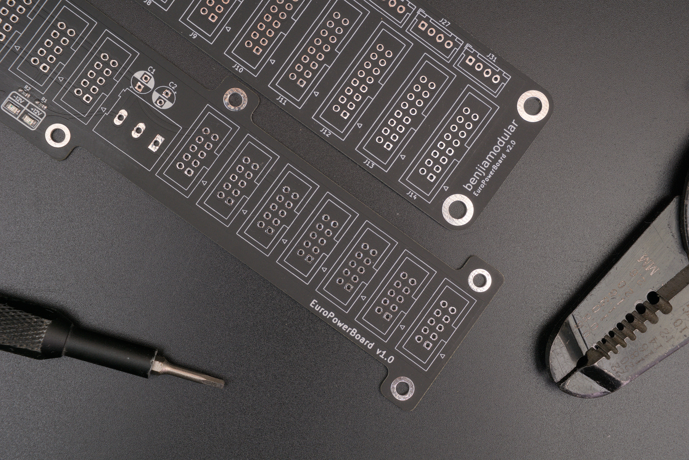

# EuroPowerBoard
[![CC BY-SA 4.0][cc-by-sa-shield]][cc-by-sa]

This is a busboard for Eurorack synths but with a modification for my own builds.

Version 1 supports 10-pin IDC/Eurorack power connectors.
Version 2 supports 16-pin IDC and 4-pin JST power connectors.

# License

This work is licensed under a
[Creative Commons Attribution-ShareAlike 4.0 International License][cc-by-sa].

[![CC BY-SA 4.0][cc-by-sa-image]][cc-by-sa]

[cc-by-sa]: http://creativecommons.org/licenses/by-sa/4.0/
[cc-by-sa-image]: https://licensebuttons.net/l/by-sa/4.0/88x31.png
[cc-by-sa-shield]: https://img.shields.io/badge/License-CC%20BY--SA%204.0-lightgrey.svg